# single-aks

Single-node AKS on Azure. Terraform + GitHub Actions for infra, ArgoCD for GitOps delivery, Rancher for cluster ops, WireGuard + Cloudflare Tunnel for access.

Companion repo: [`gitops`](https://github.com/Ntnick-22/gitops) (private — manifests ArgoCD deploys onto this cluster).

## Two repos, two jobs

**`single-aks`** (public) — **infra**. Terraform that builds the actual Azure resources: VNets, VMs, the AKS cluster itself, ACR. Applied manually, on demand, via `terraform-apply.yml`. Nothing watches this repo continuously — it only changes when you explicitly run the workflow.

**`gitops`** (private) — **what runs on top of the infra**. ArgoCD — itself installed *by* `single-aks`'s `05_helm` layer, running *inside* the cluster `single-aks` built — polls this repo every ~3 minutes and reconciles the live cluster to match it. What it actually tracks:
- 3 Helm charts (`backend`, `frontend`, `worker`), each with per-environment values (`values-dev.yaml`, `values-uat.yaml`, `values-prod.yaml`)
- 3 `ApplicationSet`s that generate all 9 resulting `Application`s (one chart × 3 envs each) from a single template per component
- `syncPolicy: { prune: true, selfHeal: true }` — git is the actual source of truth; a manual `kubectl edit` on any of these gets reverted on the next reconcile, not just flagged

**How they connect:** one-directional, not a sync loop. `single-aks` builds the platform once; `gitops` is the continuously-reconciled source of truth for everything deployed on top of it. `single-aks` doesn't know `gitops` exists — ArgoCD is the only thing watching, and it only watches `gitops`, never the infra repo. Change infra → re-run a Terraform layer by hand. Change an app → push to `gitops`, ArgoCD picks it up on its own.

## Architecture

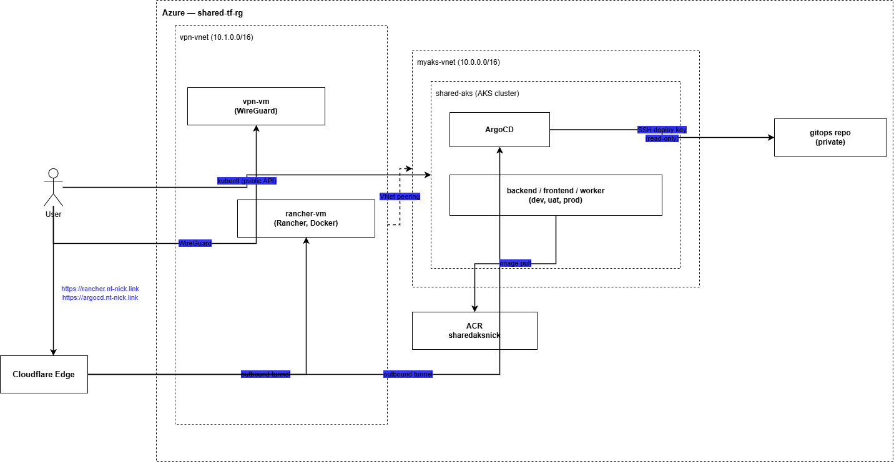

## Stack

Terraform · GitHub Actions (OIDC) · AKS · ArgoCD · Rancher · WireGuard · Cloudflare Tunnel · Traefik · cert-manager · ACR

## Layers

| Layer | Does |
|---|---|
| `00_rg` | resource group |
| `01_networking` | `myaks-vnet` (`10.0.0.0/16`) |
| `02_vm` | WireGuard VPN, peered into `myaks-vnet` |
| `03_rancher` | Rancher (Docker) + Cloudflare Tunnel connector |
| `04_aks` | AKS cluster, node pool, ACR, `AcrPull` binding |
| `05_helm` | Traefik, cert-manager, ArgoCD |

Each layer has its own remote state. Nobody runs `terraform apply` from a laptop — every change goes through GitHub Actions (`terraform-apply.yml`): pick the layer from a dropdown, it plans, then applies via OIDC-authenticated `workflow_dispatch`. Same layer, same process, every time — no drift from one-off local applies.

## Notable choices

- **WireGuard** — keys generated on both ends independently, only public keys ever transmitted.
- **Rancher + ArgoCD behind Cloudflare Tunnel** — outbound-only from each VM/pod, zero inbound ports for the management plane, real TLS certs instead of self-signed.
- **`gitops` is private** — ArgoCD authenticates via a read-only SSH deploy key scoped to that one repo, not a personal token.
- **SSH restricted to the WireGuard subnet** on every VM.

## RBAC

No shared admin login for daily use — two ArgoCD accounts, two different access levels:

| Account | Role | Can do |
|---|---|---|
| `developer` | `role:readonly` | View apps, resource trees, logs — no sync, no delete, no edit |
| `devops` | `role:admin` | Everything: sync, delete, edit RBAC/settings, manage repo credentials |

Enforced server-side via `argocd-rbac-cm`, not just hidden UI buttons — logging in as `developer` and attempting a sync fails at the API level, not just visually.

## Screenshots

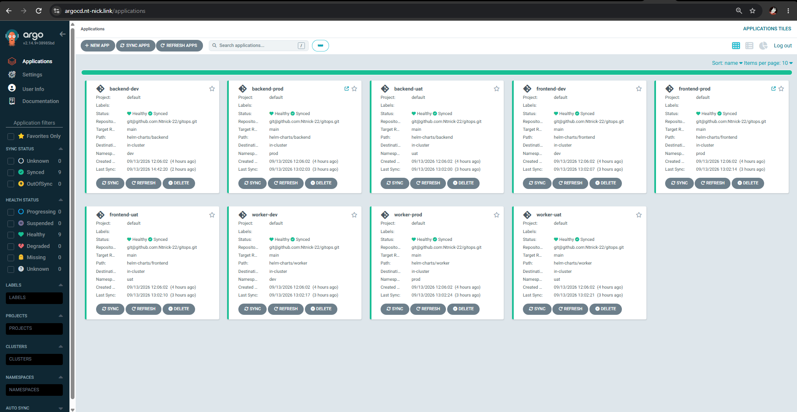
*`backend`/`frontend`/`worker` × `dev`/`uat`/`prod`, synced from the private `gitops` repo over SSH.*

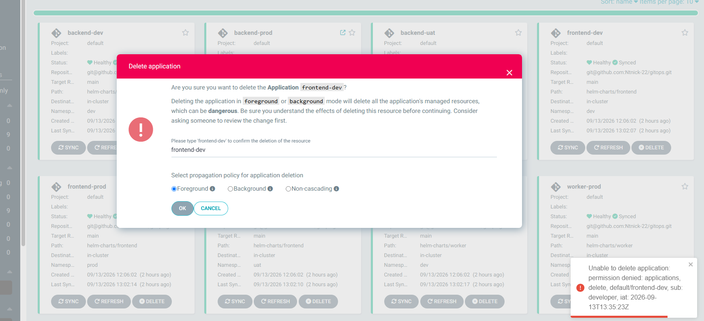
*Logged in as `developer`, a delete attempt is rejected: `permission denied: applications, delete, default/frontend-dev, sub: developer` — enforced by the API, not a hidden button.*

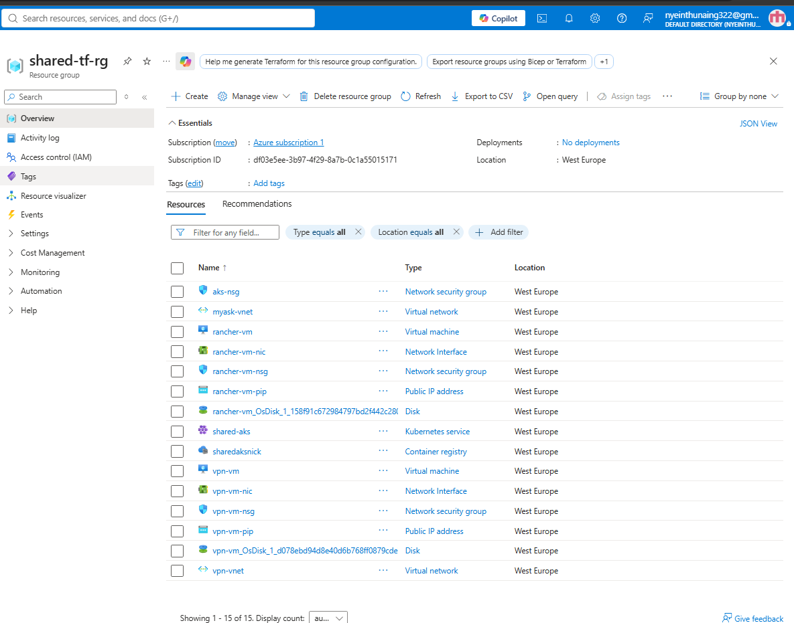
*Every resource in `shared-tf-rg`, built entirely from the Terraform layers above.*

More screenshots

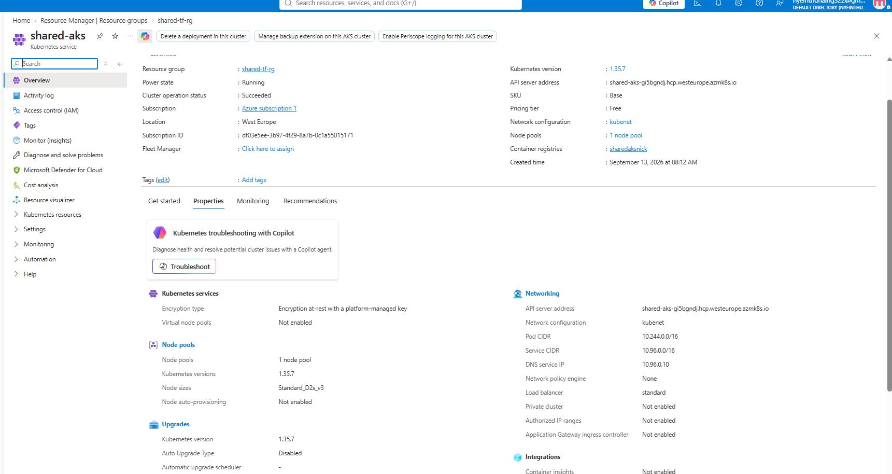
*`shared-aks` in the Azure Portal — kubenet networking, ACR linked, node pool details.*

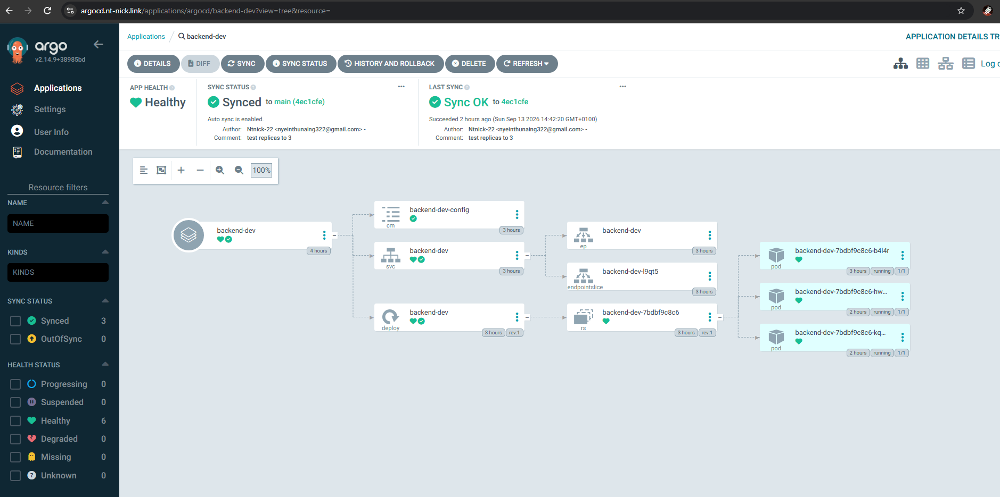
*The commit message ("test replicas to 3") shows up directly in ArgoCD's sync history — proof git is the actual source of truth, not just a config store.*

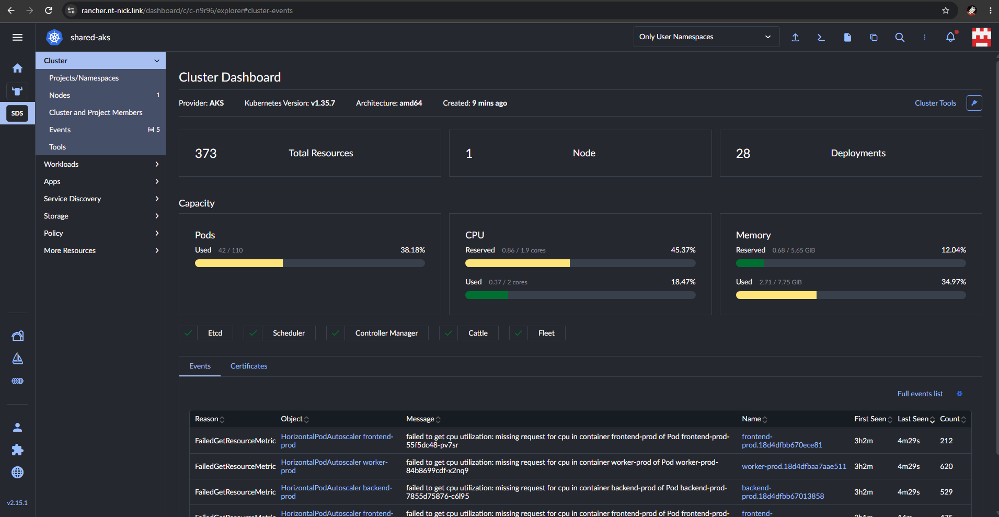
*`shared-aks` imported into Rancher — independent view of the same cluster ArgoCD manages.*

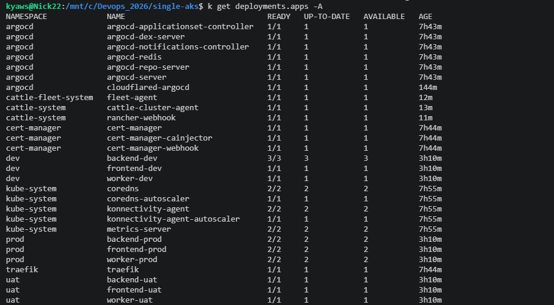
*`kubectl get deployments -A` — ArgoCD, cert-manager, Traefik, the Rancher agent (`cattle-system`), and all 9 app deployments running side by side.*

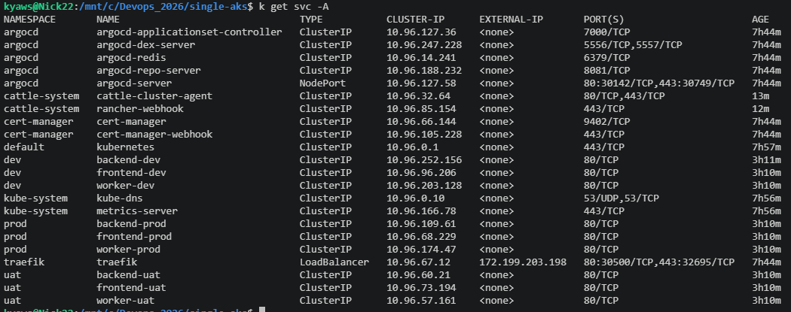
*`kubectl get svc -A` — including `argocd-server` and `traefik`'s LoadBalancer.*

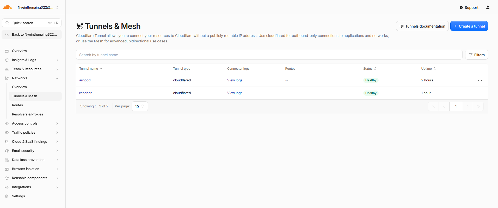
*`argocd` and `rancher` tunnels, both outbound-only, both healthy.*

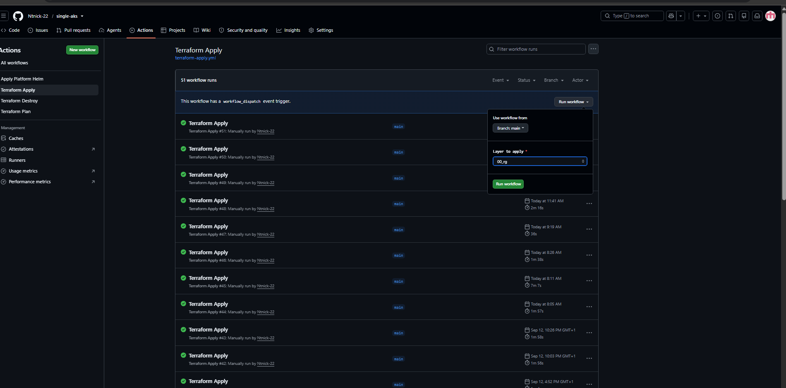
*51 runs of `terraform-apply.yml` — every infra change goes through this, layer selected from a dropdown, never a local `terraform apply`.*

